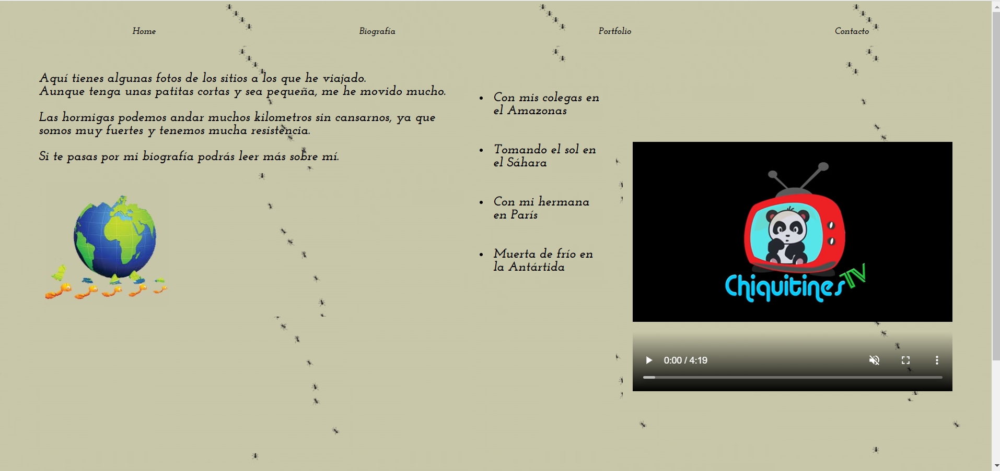

# HTML & CSS Project - My first web

<h3 align="center">HTML & CSS PROJECT</h3>

    First web page made using HTML and CSS.
     
    <a href="https://github.com/miguelherreravillanueva/Proyecto_RAMP-UP.Web/issues">Report a Bug</a>
  

<!-- TABLE OF CONTENTS -->

  
Table of Contents

  <ol>
        <li><a href="#objectives">Objectives</a></li>
    <li>
      <a href="#about-the-project">About The Project</a>
      <ul>
         <li><a href="#built-with">Built With</a></li>
      </ul>   
    </li>
    <li><a href="#future-roadmap">Future Roadmap</a></li>
    <li><a href="#contributing">Contributing</a></li>
    <li><a href="#license">License</a></li>
    <li><a href="#preview">Preview</a></li>
    <li><a href="#contact">Contact</a></li>
  </ol>

<!-- ABOUT THE OBJECTIVES -->
## Objectives
Creation of a first web using HTML & CSS.
### In this project users can see the views of: 
<objectives>
  <ol>
    <li>Home</li>
    <li>Biography</a></li>
    <li>Portfolio</a></li>
    <li>Contact</a></li>
</ol>
</objectives>

<!-- ABOUT THE PROJECT -->
## About The Project

This project is the first project of the Fullstack MERN Web Developer bootcamp. For this, I had to create a personal website with all the required elements: different pages (home, biography, portfolio, contact), inclusion of multimedia elements, web links, and forms.

The content of the website is about the biography of an ant, in which it tells its story and displays images of its adventures.

(<a href="#readme-top">back to top</a>)

### Built With

<!-- FUTURE -->
## Future Roadmap

- [ ] Keep perfectioning the page

(<a href="#readme-top">back to top</a>)

<!-- CONTRIBUTING -->
## Contributing

Contributions are what make the open source community such an amazing place to learn, inspire, and create. Any contributions you make are **greatly appreciated**.

If you have a suggestion that would make this better, please fork the repo and create a pull request. You can also simply open an issue with the tag "enhancement".
Don't forget to give the project a star! Thanks again!

1. Fork the Project
2. Create your Feature Branch (`git checkout -b feature/YourName`)
3. Commit your Changes (`git commit -m 'Add some YourName'`)
4. Push to the Branch (`git push origin feature/YourName`)
5. Open a Pull Request

(<a href="#readme-top">back to top</a>)

<!-- PREVIEW -->

## Preview 

- Vista general del quiz

<!-- LICENSE -->
## License

This project is under license of Miguel Herrera.

(<a href="#readme-top">back to top</a>)

## Contact

Made by [Miguel Herrera](https://github.com/miguelherreravillanueva)
